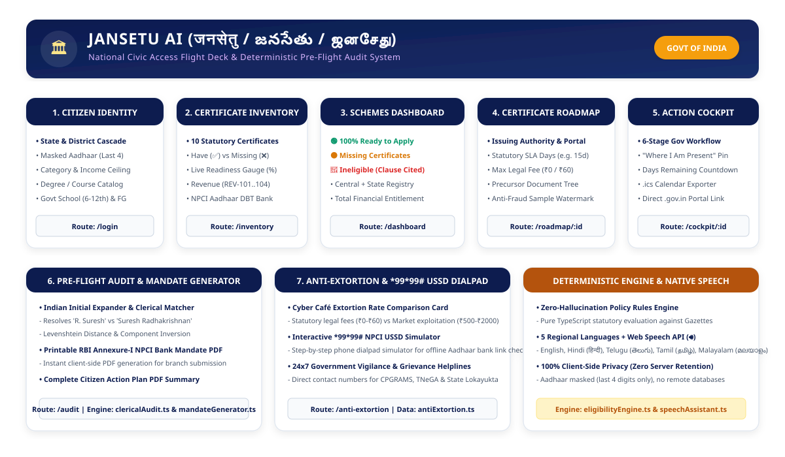

# JanSetu AI (जनसेतु / జనసేతు / ஜனசேது / ജനസേതു)

<p align="center">
  
  <br />
  <strong>National Civic Access Flight Deck & Pre-Flight Audit System for Indian Central & State Scholarships</strong>
  <br />
  <em>Democratizing Government Entitlements • Eliminating Cyber Café Extortion • Zero-Hallucination Policy Audits</em>
</p>

---

## 🏛️ System Architecture



---

## 📖 Table of Contents
1. [Overview & Core Mission](#-overview--core-mission)
2. [Key Capabilities](#-key-capabilities)
3. [The 7 Dedicated User Workflow Stages](#-the-7-dedicated-user-workflow-stages)
4. [Deterministic Policy & Audit Engines](#-deterministic-policy--audit-engines)
5. [Anti-Extortion Rate Cards & Offline USSD Dialpad](#-anti-extortion-rate-cards--offline-ussd-dialpad)
6. [Supported Central & State Schemes](#-supported-central--state-schemes)
7. [Installation & Running Guide](#-installation--running-guide)
8. [Comprehensive Project Structure](#-comprehensive-project-structure)
9. [Privacy & Security Guarantee](#-privacy--security-guarantee)
10. [Legal Disclaimer & Citations](#-legal-disclaimer--citations)

---

## 🎯 Overview & Core Mission

Every year, millions of eligible Indian students miss out on scholarships worth over **₹10,000+ Crores** or fall victim to commercial cyber café extortion (paying ₹500–₹2,000 for free government services) due to:
1. **Clerical Name Mismatches**: Rejections caused by simple format differences (e.g., `R. Suresh` vs. `Suresh Radhakrishnan`) between Aadhaar, 10th/12th Marksheets, and Bank Passbooks.
2. **Mandatory Aadhaar-NPCI DBT Disconnects**: Funds failing to credit because the bank account is not mapped to the NPCI Aadhaar payment bridge.
3. **Complex Certificate Hierarchies**: Students not knowing issuing authorities, precursor requirements, statutory SLAs, or legal maximum fees.
4. **LLM Hallucinations in Public Governance**: Generic AI models inventing non-existent criteria.

**JanSetu AI** solves this with a **100% deterministic, zero-hallucination policy rules engine** and pre-flight civic flight deck that audits citizen eligibility and generates actionable roadmaps and printable legal bank mandates.

---

## 🌟 Key Capabilities

- **Zero Hallucination Guarantee**: All scheme evaluations are performed through deterministic TypeScript policy rules grounded directly in Central & State Government Gazettes.
- **Dedicated Multi-Page Flow**: Clear 7-step separation with persistent state management across the citizen journey.
- **Clerical Initials & Fuzzy Name Matcher**: Levenshtein distance and Indian initial expansion engine to catch discrepancies before official submission.
- **Printable RBI Annexure-I Bank Mandate PDF**: Instant generation of official bank application forms for Aadhaar-NPCI DBT seeding.
- **Anti-Extortion Rate Cards**: Direct comparison between legal statutory fees (₹0 / ₹60) and illicit cyber café exploitation rates.
- **Interactive `*99*99#` USSD Dialpad Simulator**: Allows citizens to test and learn how to verify NPCI bank linkage without an active internet connection.
- **Multilingual Web Speech Audio Readout (🔊)**: Native text-to-speech assistant supporting **English**, **Hindi (हिन्दी)**, **Telugu (తెలుగు)**, **Tamil (தமிழ்)**, and **Malayalam (മലയാളം)**.
- **Privacy-First Architecture**: Only the last 4 digits of Aadhaar are processed (`XXXX - XXXX - 1234`). Zero server-side data retention.

---

## 🗺️ The 7 Dedicated User Workflow Stages

```
   [1. Profile & Demographics] ──► [2. Certificate Inventory] ──► [3. Schemes Dashboard]
                 │                                                           │
                 ▼                                                           ▼
   [7. Anti-Extortion & Dialpad] ◄── [6. Pre-Flight Audit & PDF] ◄── [4. Roadmap & Cockpit]
```

### 1. Citizen Profile & Demographics (`/login`)
- Real-time State $\rightarrow$ District dynamic cascade covering all 28 Indian States & UTs.
- Dynamic Education Level $\rightarrow$ Course/Degree catalog (Engineering, Medical, Arts & Science, Diploma, School 9-12, PG, Ph.D.).
- Statutory criteria inputs: Annual Family Income, Caste Category, 6-12th Government School attendance, and First Graduate status.
- 4 Instant Quick-Test Personas (Priya, Ravi, Arjun, Pooja) for rapid demonstrations.

### 2. Certificate Inventory Audit (`/inventory`)
- Dynamic 10-certificate checklist: Aadhaar, 10th/12th Marksheet, Income (REV-101), Nativity (REV-102), Community (REV-103), First Graduate (REV-104), 7.5% Govt School Annexure-III, College Bonafide, NPCI Bank Passbook, and Ration Card.
- Interactive Have (✅) vs. Don't Have (❌) toggles with a live **Readiness Gauge (%)**.

### 3. Calculated Schemes Dashboard (`/dashboard`)
- Categorizes all evaluated Central and State schemes into 3 transparent tiers:
  - 🟢 **100% Ready to Apply**: Citizen meets all criteria and possesses all required certificates.
  - 🟠 **Conditionally Eligible (Missing Certificates)**: Citizen meets criteria but needs specific documents; opens a direct Resolution Roadmap.
  - 🔴 **Ineligible (Clause Cited)**: Exact statutory disqualification reasons with zero hallucination.
- Displays total potential financial entitlements in ₹ Lakhs.

### 4. Dedicated Missing Certificate Resolution Roadmap (`/certificate-roadmap/:id`)
- Breakdown of issuing authority (e.g., *Revenue Dept / Tahsildar / School Headmaster*).
- Official statutory delivery SLA (e.g., 15 Days) and legal maximum fee (₹0 - ₹60).
- Precursor document tree and anti-fraud sample watermarked preview.

### 5. Scheme Action Cockpit & Government Tracker (`/scheme-cockpit/:id`)
- 6-stage government processing timeline (e.g., *OTR Submission $\rightarrow$ College INO Verification $\rightarrow$ SNO Allocation $\rightarrow$ PFMS Sanction $\rightarrow$ NPCI DBT Credit*).
- Interactive *"Where I Am Present"* position marker.
- Real-time countdown timer to the statutory application deadline.
- One-click `.ics` calendar reminder export.

### 6. Pre-Flight Clerical Name Matcher & Annexure-I Mandate Generator (`/audit`)
- Side-by-side comparison of applicant name across Aadhaar, 10th/12th Marksheet, and Bank Passbook.
- Deterministic clerical name score & discrepancy warnings.
- Instant client-side generation of the **Printable RBI Annexure-I Application Form** for NPCI DBT seeding.
- Instant client-side download of the full **Citizen Action Plan PDF Report**.

### 7. Anti-Extortion Hub & Interactive USSD Simulator (`/anti-extortion`)
- Statutory vs. Cyber Café fee comparison table.
- Interactive virtual smartphone dialpad simulating the offline `*99*99#` Aadhaar-bank link verification service.
- Emergency 24x7 Government Grievance Helplines (CPGRAMS 1800-11-4000, TNeGA 1100, Lokayukta).

---

## ⚙️ Deterministic Policy & Audit Engines

### 1. `EligibilityEngine.ts`
Evaluates demographic, socio-economic, and academic rules against scheme definitions:
```typescript
// Deterministic Multi-Clause Audit
const status = failedClauses.length > 0
  ? 'INELIGIBLE'
  : missingCertificates.length > 0
    ? 'CONDITIONALLY_ELIGIBLE'
    : 'READY_TO_APPLY';
```

### 2. `ClericalAudit.ts`
Resolves cultural naming conventions in India (initial expansion, surname prefix/suffix, spacing):
```typescript
// Handles 'S. Kavin', 'Kavin S', 'Kavin Shanmugam'
const auditResult = ClericalAuditEngine.auditNames(aadhaarName, marksheetName, passbookName);
```

### 3. `MandateGenerator.ts` & `ActionPlanPdfGenerator.ts`
Generates high-resolution, vector-crisp PDF documents using `jspdf` and `jspdf-autotable` with sanitized Latin formatting and `Rs.` currency rendering.

---

## 🚀 Installation & Running Guide

### Prerequisites
- **Node.js**: v18.0.0 or higher
- **npm**: v9.0.0 or higher (or `pnpm` / `yarn`)

### Quick Start in 3 Commands

```bash
# 1. Clone repository
git clone https://github.com/mahaboobali1212/JanSetu-AI.git
cd JanSetu-AI

# 2. Install dependencies
npm install

# 3. Start local development server
npm run dev
```

The application will launch on `http://localhost:3000/` (or `http://localhost:5173/`).

### Production Build & Verification

```bash
# Type check and build production bundle
npm run build

# Preview production build locally
npm run preview
```

---

## 📂 Comprehensive Project Structure

```text
JanSetu-AI/
├── public/
│   └── assets/
│       ├── architecture_diagram.svg       # Full System Architecture Flowchart
│       ├── government_emblem.png          # Lion Capital of Ashoka (Govt of India Emblem)
│       └── scholarship_hero.png           # Hero Banner Asset
│
├── src/
│   ├── components/                        # Shared UI Components & Layout
│   │   ├── Header.tsx                     # Top Bar: Gold Seal, Language Switcher, Title
│   │   └── Footer.tsx                     # Footer: Helpline Numbers, Disclaimer, Links
│   │
│   ├── data/                              # Static Master Registries & Gazette Datasets
│   │   ├── antiExtortion.ts               # Statutory vs Cyber Cafe Rate Cards & Helplines
│   │   ├── certificates.ts                # 10 Statutory Certificates (REV-101..104, SLAs, Fees)
│   │   ├── courses.ts                     # Dynamic Education Level & Course/Degree Catalog
│   │   ├── districts.ts                   # 28 States & UTs Authentic District Registry
│   │   ├── personas.ts                    # 4 Instant Demo Profiles (Priya, Ravi, Arjun, Pooja)
│   │   ├── schemesCentral.ts              # Central Schemes (NSP PM-USP, AICTE, DST, MoSJE)
│   │   ├── schemesStates.ts               # State Schemes (TN, TS, AP, KL, KA, MH, UP)
│   │   └── translations.ts                # 5 Languages UI Strings (EN, HI, TE, TA, ML)
│   │
│   ├── engine/                            # Core Algorithmic & Generation Engines
│   │   ├── actionPlanPdfGenerator.ts      # Printable Action Plan PDF Builder (jsPDF)
│   │   ├── calendarGenerator.ts           # iCalendar (.ics) Deadline Reminder Exporter
│   │   ├── clericalAudit.ts               # Indian Initial Expander & Fuzzy Name Matcher
│   │   ├── eligibilityEngine.ts           # Deterministic Policy Evaluator (Zero-Hallucination)
│   │   ├── mandateGenerator.ts            # RBI Annexure-I Bank Mandate PDF Generator
│   │   └── speechAssistant.ts             # Web Speech API Regional Audio Assistant (🔊)
│   │
│   ├── pages/                             # 7 Dedicated Application Stages (Single-Page Views)
│   │   ├── LoginPage.tsx                  # Stage 1: Citizen Profile & Demographics Setup
│   │   ├── InventoryPage.tsx              # Stage 2: Certificate Inventory Audit & Readiness Gauge
│   │   ├── DashboardPage.tsx              # Stage 3: Calculated Schemes & Entitlement Dashboard
│   │   ├── CertificateRoadmapPage.tsx     # Stage 4: Missing Certificate Resolution Roadmap
│   │   ├── SchemeCockpitPage.tsx          # Stage 5: Scheme Action Cockpit & 6-Stage Gov Tracker
│   │   ├── PreFlightAuditPage.tsx         # Stage 6: Pre-Flight Clerical Matcher & PDF Mandate
│   │   └── AntiExtortionPage.tsx          # Stage 7: Anti-Extortion Hub & *99*99# USSD Dialpad
│   │
│   ├── types/                             # TypeScript Strict Schemas & Type Contracts
│   │   ├── certificate.ts                 # Certificate Keys, Metadata, and Inventory Schemas
│   │   ├── language.ts                    # Supported Indic Language Keys & Display Labels
│   │   ├── profile.ts                     # Citizen Profile, Schooling, and Caste Enums
│   │   └── scheme.ts                      # Scheme Criteria, Gazette Clauses, and Workflow Types
│   │
│   ├── App.tsx                            # Root Component: State Store & Page Router
│   ├── index.css                          # Luxury Editorial CSS, Indian Color System & Fonts
│   └── main.tsx                           # Application Bootstrap Entrypoint
│
├── index.html                             # Web Shell with Google Webfonts (Cinzel, Garamond)
├── package.json                           # NPM Dependencies, Scripts, and Metadata
├── postcss.config.js                      # PostCSS Processor Configuration
├── tailwind.config.js                     # Custom Color Tokens (Ivory, Tiranga, Imperial Gold)
├── tsconfig.json                          # TypeScript Compiler Rules & Target Settings
└── vite.config.ts                         # Vite Development & Production Bundler Settings
```

### Module Breakdown Summary

| Directory / Layer | Description & Key Responsibilities |
| :--- | :--- |
| **`src/engine/`** | The core computation layer. Contains the zero-hallucination policy evaluation logic, clerical string audit algorithms, speech synthesis, and vector PDF document generators. |
| **`src/data/`** | Ground-truth datasets containing official gazette rules, statutory fee schedules, regional language translations, course catalogs, and all-India district lists. |
| **`src/pages/`** | 7 discrete, dedicated user interface stages that guide the citizen sequentially from profile setup to final scheme application. |
| **`src/types/`** | Strict TypeScript interfaces ensuring type safety and schema validation across all engines, datasets, and UI components. |
| **`public/assets/`** | High-resolution static media assets including the National Emblem and the visual system architecture diagram. |

---

## 🔒 Privacy & Security Guarantee

- **Zero Cloud Storage**: Citizen demographic and academic data is processed strictly in the client's browser runtime.
- **Aadhaar Masking**: Only the last 4 digits are entered (`XXXX - XXXX - 1234`). Full 12-digit Aadhaar numbers are never stored.
- **Non-Invasive Architecture**: All PDF generation (Annexure-I Mandate and Action Plan) occurs client-side using JavaScript canvas and vector rendering.

---

## 📜 Legal Disclaimer & Citations

*JanSetu AI is an independent, non-commercial civic access platform built to guide citizens through official Government of India and State Government welfare schemes. All rules, clauses, and benefits are grounded in published Government Gazettes (e.g., MoE CSSS Guidelines, AICTE Act Sec 10(1), TN Act No. 14 of 2021, and respective State e-Governance portals). Official applications must always be submitted via respective `.gov.in` portals.*

---

<p align="center">
  <strong>JanSetu AI • Built for 1.4 Billion Citizens • Digital India Initiative</strong>
</p>
